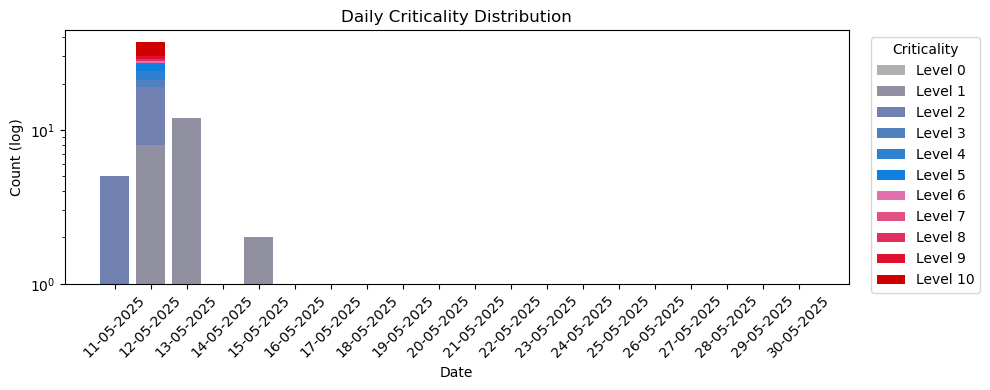

#Daily diary

# Program
By running the run.bat a tkinter GUI should open up. If you use the sequence csv here are the steps to do it:
1. Select the correct COM ports for the devices.
2. Input the sheath flow
3. Adjust the recording time which is how often things are logged.
4. Load sequence CSV
5. Adjust corona voltage
6. Start Measurement

The other stuff is for manual testing and calibration but for long term measurement you should use the sequence csv. When you open up the secuence csv you can add or remove lines and adjust things as wanted. The program will stay on sequence mode as long as it's running after you have loaded the wanted file by pressing the blue "Load Sequence CSV".

# Installation
Step-by-step:
1. Press the green code and download everything as a zip and extract it.
2. first run the install.bat. It checks python version, make a venv, installs the modules and checks if nidaqmx driver is working.
3. Then you should be able to run the run.bat.

## Errors in installation
The install.bat should guide you and make it easy but idk how to install all so you might need to manually install the correct python versions and nidaqmx driver
1. If the python version is not correct it should install a .exe file for this which you need to run and install. If the automatic process does not work you can find correct python version in [python.org](https://www.python.org/ftp/python/3.12.3/) and install the amd64.exe version and run it.
2. The NI daq card needs a driver to run it with python script. The install.bat should send you to NI website where you need to login and install the driver. If it doesn't send you there either it has worked or use this link [NI-daqmx driver](https://www.ni.com/en/support/downloads/drivers/download.ni-daq-mx.html#565026)

 
